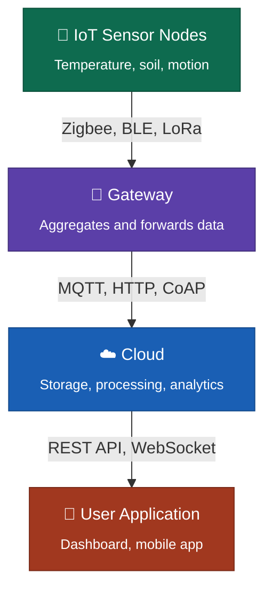

# Q39. (Theory) What is an IoT Gateway?

**Question:** What is an IoT gateway? Draw a simple diagram showing the relationship between: IoT Sensor Nodes → Gateway → Cloud → User Application. What protocols are typically used at each layer? *(2 marks)*

---

## Answer

An IoT gateway sits between sensor nodes and the cloud. It collects data from multiple sensors (often over low power, short range protocols), then converts and forwards it to the internet using standard networking protocols. It can also do local processing, filtering, and protocol translation, so sensors don't have to talk directly to the cloud.

## Diagram: Sensor Nodes → Gateway → Cloud → User Application

## Protocols Typically Used at Each Layer

| Layer | Protocols |
|---|---|
| **Sensor Nodes → Gateway** | Zigbee, BLE, LoRa, Z-Wave |
| **Gateway → Cloud** | MQTT, HTTP/HTTPS, CoAP |
| **Cloud → User Application** | REST API, WebSocket |
